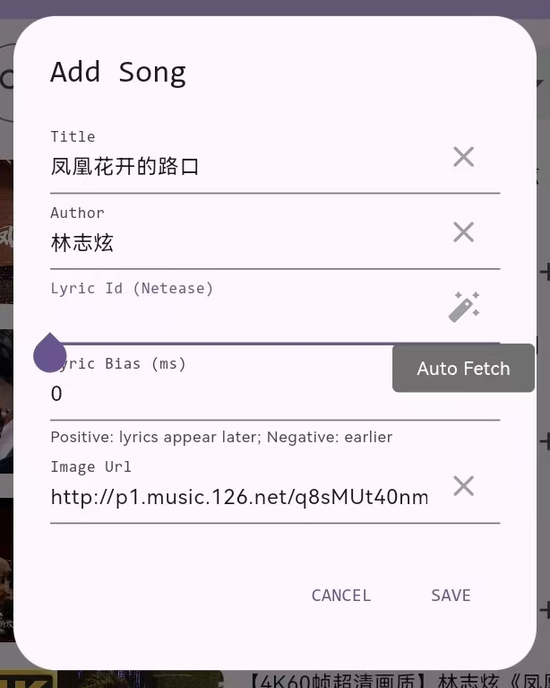

# Bili Music

使用 Flutter 开发的，以 BiliBili 为音频源的音乐播放器。

## 功能

- [x] 媒体搜索

  除常规搜索外，还支持直接输入ID（B站：bv_id；网易云：song_id）、URL（原链接、短链接（可含其他文字））

- [x] 音乐播放

- [x] LLM提取歌曲信息：歌曲名称、歌手（符合OpenAI接口即可）

  非常建议使用！便于从网易云获取歌曲ID、歌词、封面

  免费的大模型API：

  * [智谱（链接含邀请码）](https://www.bigmodel.cn/login?icode=Pe+h7w7M3Gx9gG4r3CNzLEjPr3uHog9F4g5tjuOUqno=&from=invite&redirect=/)的glm4-flash
  * [GPT_API_free](https://github.com/chatanywhere/GPT_API_free)

- [x] 滚动歌词

  B站：依赖CC字幕，需要登录

  网易云音乐：无需登录

- [x] 根据歌曲名称+歌手，从网易云音乐获取歌曲ID；根据歌曲ID获取歌词、歌曲封面

  * 如果未添加LLM API，可在手动输入歌曲名称和歌手，点击Auto Fetch按钮获取

    

  * 一些网易云已下架的音乐，无法用网易云的API进行搜索，但是依旧能被搜索引擎找到，如[枫 - 周杰伦](https://music.163.com/#/song?id=185912)。所以能够通过直接输入歌曲ID获取歌词、歌曲封面。

- [ ] 收藏夹导入

- [ ] 下载

- [ ] More

## 感谢

- [bilibili-API-collect](https://github.com/SocialSisterYi/bilibili-API-collect): 哔哩哔哩第三方 API 收集参考

